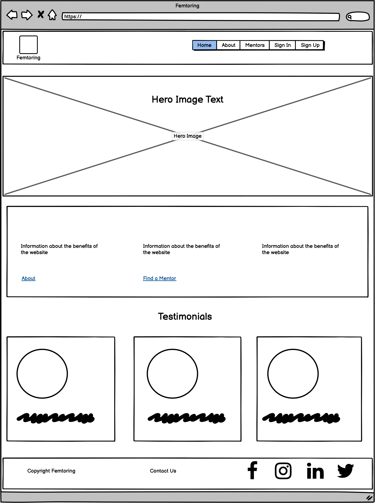
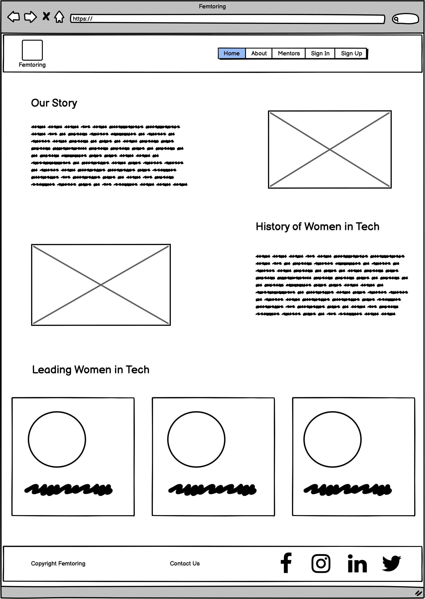
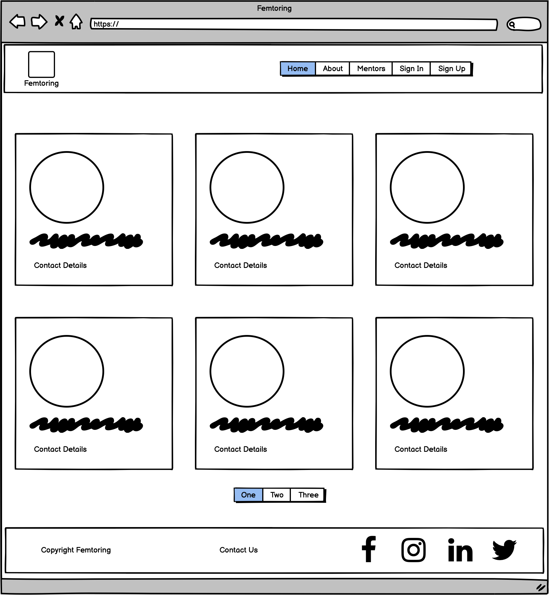

# Initial MVP idea:

This website represents a solution to a very common issue in the world, women's lack of representation. Its goal is to represent important women in tech, past and present, and to enable communication between them and women in tech so that the gap can be bridged.

This is done by creating a portal-type site where members can see the mentors, their achievements and where they work. Through this the user can log in as a mentor or user, and users can book an appointment and send a message to the mentor.

The link for the deployed site can be found here: https://femtoring.herokuapp.com

# Design

Color Scheme:


-   #F67280
-   #F8B195
-   #C06C84
-   #6C5B7B
-   #355C7D​

# Typography:
Lato and Roboto were used from Google Fonts​

# Imagery:
pexels.com was used to source copyright free images for the website gallery and tinypng was used to compress file size​.

# Logo:

-   Logo icon was created using https://www.freelogodesign.org/
-   https://favicon.io/ was used to create the favicon

# Wireframes:


|  |
| :-------------------------------------------------: |
|             <b>Home page wireframe</b>              |
 <br />

|  |
| :--------------------------------------------------------: |
|               <b>About us page wireframe</b>               |
 <br />

|  |
| :------------------------------------------------------------: |
|                 <b>Mentors page wireframe</b>                  |
 <br />
## Canvas:

# Technology:

## Tech Stack:
​Technologies Used: HTML, CSS, JavaScript, jQuery, Bootstrap, Python, Flask, GitHub, Git, Bash, Go

# File structure:
```

.
├── static
│   ├── css
│   │    └── base.css
│   ├── images
│   └── js
│        └── base.js
├──templates/
    |── index.html
    |── about.html
    |── mentors.html
    |── signup.html
    └── login.html

```
