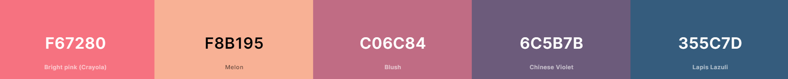
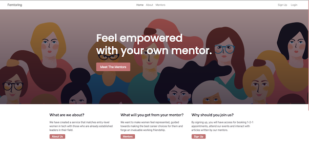
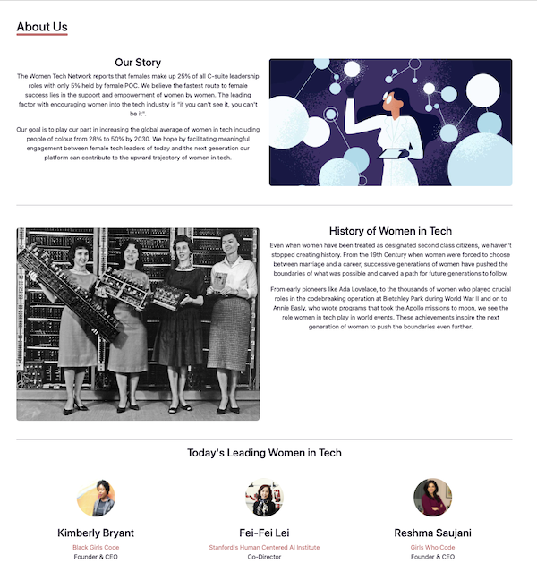
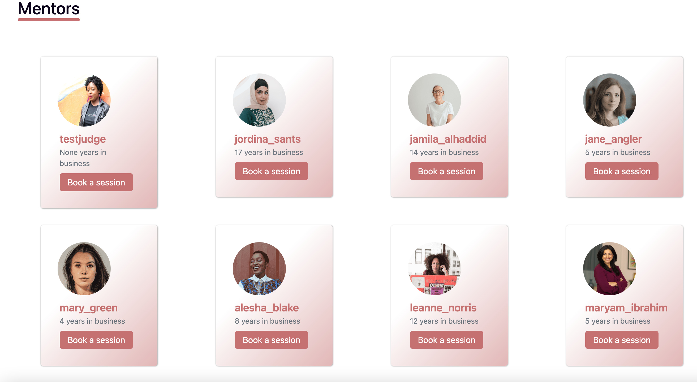
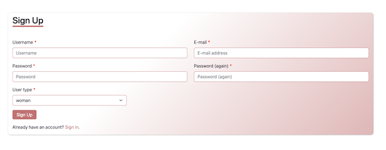
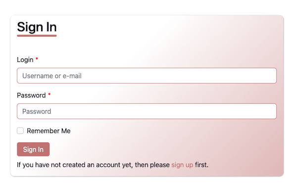
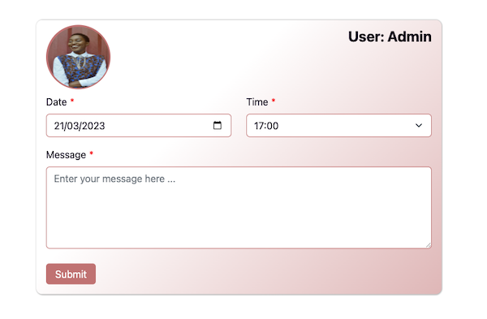
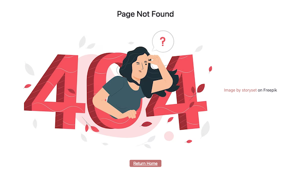

# Initial idea:

This website represents a solution to a very common issue in the world, women's lack of representation. Its goal is to represent important women in tech, past and present, and to enable communication between them and women in tech so that the gap can be bridged.

This is done by creating a portal-type site where members can see the mentors, their achievements and where they work. Through this the user can log in as a mentor or user, and users can book an appointment and send a message to the mentor.

Link to an example type of women in tech website: https://femtoring.herokuapp.com. This is for guidance purposes only please be creative and do not copy the site content.

# Design

Color Scheme:


-   #F67280
-   #F8B195
-   #C06C84
-   #6C5B7B
-   #355C7D​

# Typography:

Lato and Roboto were used from Google Fonts​ https://fonts.google.com/

# Logo:

-   Logo icon was created using https://www.freelogodesign.org/
-   https://favicon.io/ was used to create the favicon

# Wireframes:

|  |
| :-------------------------------------------------: |
|             <b>Home page wireframe</b>              |

 <br />

|  |
| :--------------------------------------------------------: |
|               <b>About us page wireframe</b>               |

 <br />

|  |
| :------------------------------------------------------------: |
|                 <b>Mentors page wireframe</b>                  |

 <br />

# Technology:

## Tech Stack:

​Technologies Used: HTML, CSS, JavaScript, Canvas.

# File structure:

```
.
├── assets/
│   ├── css
│   │    └── base.css
│   ├── images
│   └── js
│        └── base.js
├──templates/
    |── index.html
    |── about.html
    |── mentors.html
    |── contact.html
    |── signup.html
    └── login.html
```

# Features:

-   Navigation bar: This is at the top of every bar. It allows the user to move between pages.
    

-   Home page: Here you can find information on the website's goals and purpose, as well as links to the rest of the pages.
-   About page: This contains information on the website and the team behind it. There is also information on the history of women in tech and some examples of modern-day women tech leaders.
    
-   Mentors page: This contains the different profiles for the mentors, the user can click on them and go into each one of them.
    
-   Sign-up page: Visitors to the website can sign up as a mentor or a user seeking mentorship.
    
-   Log-in page: Visitors to the website can log in if they have signed up already.
    
-   Contact Mentor: Users can choose a mentor and contact them to arrange a meeting.
    
-   404 Page: if the user navigates to a page that doesn't exist 404 page comes up and presents a link back to home.
    

PS: Users must be logged in before they can contact the mentor.

# Group Task

You are in mixed-level groups with different experiences and expertise to combine your skills to achieve the task:

Roles to consider within the group:

-   Those with artistic flair and creativity who can design the initial concept of the website using canvas tools. They will lay the visual foundation for the project.

-   Those proficient in HTML, CSS, and basic JavaScript who will implement the designs created. They will focus on building static web pages and ensuring cross-device compatibility.

-   'Experienced' coders with full-stack knowledge who will add dynamic features, such as user authentication and backend logic, to make the website interactive and engaging. They will integrate these features into the project.
